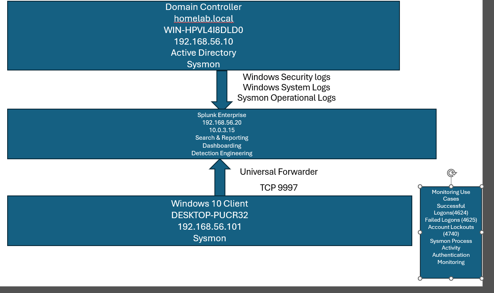
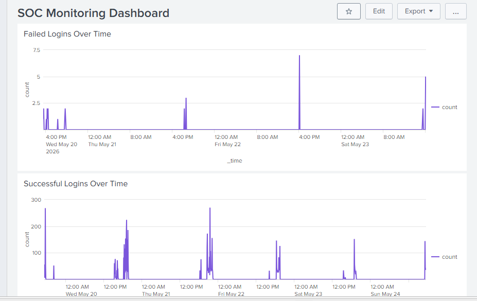
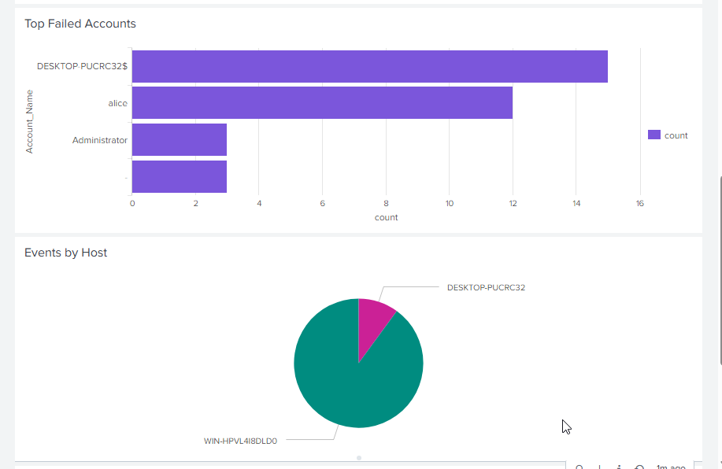

# Active Directory & Splunk SOC Lab

## Project Overview

This project demonstrates the creation of a Security Operations Center (SOC) home lab using:

- Active Directory
- Windows Server Domain Controller
- Windows 10 Endpoint
- Sysmon
- Splunk Enterprise
- Splunk Universal Forwarder

The objective was to centralize Windows Security and Sysmon logs, perform security investigations, and develop detections for authentication-related events.

---

## Architecture



---

## Environment

| System | Role |
|----------|----------|
| WIN-HPVL4I8DLD0 | Domain Controller |
| DESKTOP-PUCRC32 | Windows 10 Endpoint |
| Splunk Enterprise | SIEM Platform |

---

## Log Sources

### Windows Security Logs

- Event ID 4624 – Successful Logon
- Event ID 4625 – Failed Logon
- Event ID 4672 – Special Privileges Assigned
- Event ID 4740 – Account Lockout

### Sysmon Logs

- Process Creation
- Process Termination
- Endpoint Activity Monitoring

---

## Security Monitoring Dashboard

The dashboard includes:

- Failed Logins Over Time
- Successful Logins Over Time
- Top Failed Accounts
- Events by Host
- Top Security Event IDs

SOC Monitoring Dashboard


Investigation Panels


---

## Example SPL Queries

### Failed Logons (Event ID 4625)

Purpose: Identify failed authentication attempts and potential brute-force activity.

```spl
index=main EventCode=4625
|stats count by Account_Name Failure_Reason
|sort-count
```

### Successful Logons (Event ID 4624)

Purpose: Monitor successful authentication activity to establish user behavior baselines and identify potentially suspicious account access.

```spl
index=main EventCode=4624
| stats count by host
```
### Account Lockouts (Event ID 4740)

Purpose: Detect account lockouts that may indicate password spraying, brute-force attacks, or repeated authentication failures.

```spl
index=main EventCode=4740
| stats count by TargetUserName
```
### Top Failed Accounts

Purpose: Identify accounts generating the highest number of failed authentication attempts to support investigation of credential attacks and misconfigured systems.

```spl
index=main EventCode=4625
| stats count by Account_Name
| sort - count
```

### Events by Host

Purpose: Analyze event distribution across hosts to identify systems generating unusual volumes of security activity.

```spl
index=main
| stats count by host
```
### Top Security Event IDs

Purpose: Identify the most frequently occurring security events to understand authentication trends and prioritize monitoring efforts.

```spl
index=main sourcetype=WinEventLog:Security
| stats count by EventCode
| sort - count
```
### Multiple Failed Logons Alert

Purpose: Detect potential brute-force or password-spraying activity by identifying accounts that generate multiple failed logon attempts within a short period.

```spl
index=main EventCode=4625
| bucket span=5m _time
| stats count by _time Account_Name host
| where count >= 5
```

---

## Skills Demonstrated

- Active Directory Administration
- Windows Event Logging
- Sysmon Deployment
- Splunk Enterprise Administration
- Universal Forwarder Configuration
- SPL Query Development
- Dashboard Creation
- Authentication Monitoring
- Security Investigation

---

## Lessons Learned

- Deploying Sysmon improves endpoint visibility.
- Universal Forwarders simplify centralized log collection.
- Windows Security Event IDs can be leveraged to create practical SOC detections.
- Dashboards provide visibility into authentication activity across multiple hosts.
- Detection Engineering
- - Threat Hunting
---

## Future Improvements

## Future Improvements

- Detect encoded PowerShell commands
- Monitor PowerShell network connections (Sysmon Event ID 3)
- Create additional threat hunting use cases
- Implement email or webhook alert notifications
- Expand monitoring to additional endpoints
- Develop custom detection engineering content

## Detection Use Cases

The SOC lab currently includes the following detections:

| Detection | Data Source | Event ID | MITRE ATT&CK |
|------------|------------|-----------|--------------|
| Multiple Failed Logons | Windows Security Logs | 4625 | T1110 - Brute Force |
| Account Lockout Detected | Windows Security Logs | 4740 | T1110 - Brute Force |
| PowerShell Execution Detected | Sysmon | 1 | T1059.001 - PowerShell |
